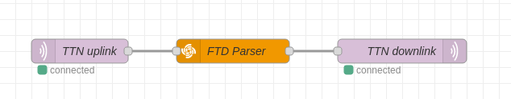

@rakwireless/field-tester-server
================================

A [Node-RED](http://nodered.org) node to process and report LoRaWAN gateway coverage data to Field Tester devices like RAK10701. It's an implementation of Paul Pinault [backend service](https://github.com/disk91/WioLoRaWANFieldTester/blob/master/doc/DEVELOPMENT.md).

[](https://www.npmjs.com/package/@rakwireless/field-tester-server)
[](https://www.npmjs.com/package/@rakwireless/field-tester-server)

---

## Install

The easiest way to install this node from Node-RED is to go to the top right menu (three horizontal lines) and then select `Manage palette` option. Then select the `Install` tab and search for **@rakwireless/field-tester-server**. Click on the small `install` button next to the node. 

You can also install it manually on your Node-RED server by running the following command in your Node-RED user directory, typically `~/.node-red`:

```
npm install "@rakwireless/field-tester-server"
```

Finally, you can also install it from the source code (this repository), again from the Node-RED user directory:

```
npm install "path-to-workspace/field-tester-server/node-red-node"
```

Once installed the node will be available from the node library under the `rakwireless` section.

## Usage
 
The node is pretty self explanatory. The node exposes a couple of properties: the name and the parser to use. The name, like with every other node in Node-RED, lets you identify the node in your flow. The parser let's you specify what kind of input the node should expect.



### Input

Depending on the "Parser" option in the node configuration, the node expects a certain payload as input:

* **The Things Stack v3**: feed the node directly to the output of an *mqtt in* node connected to an instance of The Things Stack (like TTN). 
* **ChirpStack v3 or v4**: feed the node directly to the output of an *mqtt in* node connected to an instance of ChirpStack. This will work also for the embedded server in RAKwireless gateways.
* **Raw data**: the node expects a specific input format, see below.

The format for the **Raw data** parser must be:

* bytes: array of 10 bytes with the device payload
* uplink_counter: unique incrementing number
* gateways: array of gateways, each gateway object must have:
    * rssi: signal quality as received by that gateway
    * location: object with latitude and longitude properties with the location of the gateway

Example:

```
{
    "bytes": [0x1d, 0x63, 0x67, 0x81, 0xdc, 0x67, 0x04, 0x41, 0x08, 0x0b],
    "uplink_counter": 13,
    "gateways": [
        { "rssi": -119, "location": { "latitude": 41.42, "longitude": 2.13 } },
        { "rssi": -108, "location": { "latitude": 41.30, "longitude": 2.22 } }
    ]
}
```

### Output

Again, depending on the parser used the output will change to match the specific LNS downlink format. For the Thhe Things Stack and ChirpStack parsers the node will take care not only of the payload format but also of the default topic, so you can feed the output directly to an *mqtt out* node connected to the same broker.

For the **Raw data** parser, the node will output all the parsed information along with processed information to the payload. It's up to the user to format it further. An example of the output payload can be:

```
{
    "latitude":41.6014325,
    "longitude":2.6221077,
    "altitude":95,
    "accuracy":0.8,
    "hdop":0.6,
    "sats":15,
    "num_gateways":2,
    "min_distance":119,
    "max_distance":320,
    "min_rssi":-104,
    "max_rssi":-98,
    "buffer":[36,96,102,0,0,2]
}
```

## Contribute

There are several ways to contribute to this project. You can [report](http://github.com/rakwireless/field-tester-server/issues) bugs or [ask](http://github.com/rakwireless/field-tester-server/issues) for new features directly on GitHub.
You can also submit your own new features of bug fixes via a [pull request](http://github.com/rakwireless/field-tester-server/pr).

## License

This project is licensed under [Apache 2.0](http://www.apache.org/licenses/LICENSE-2.0) license.
